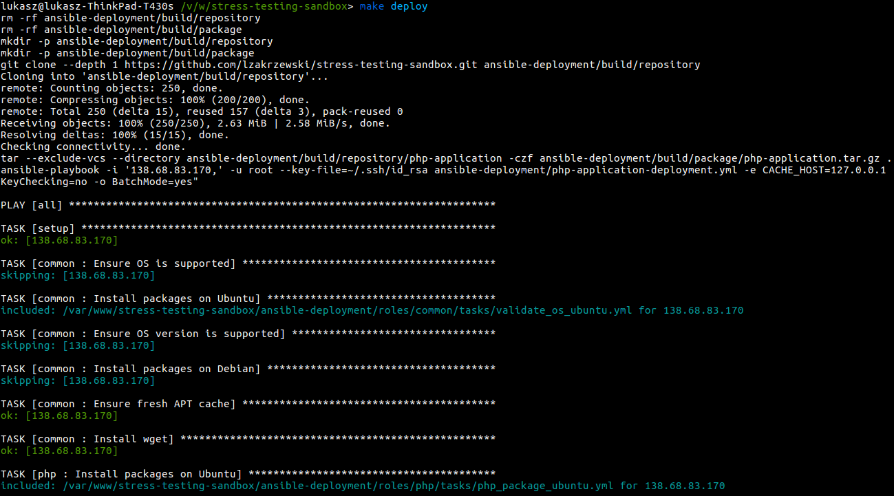
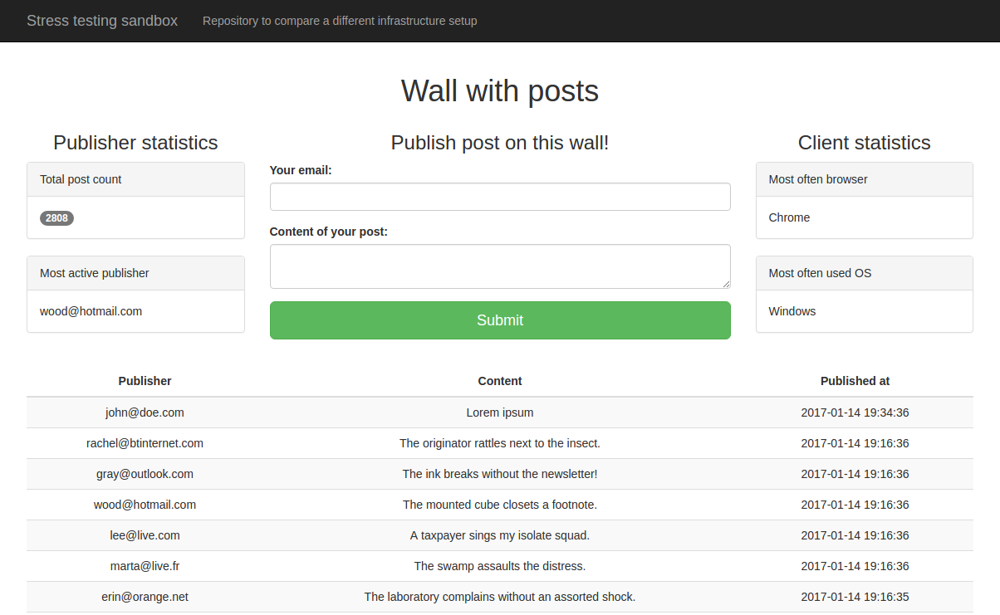

# Installation [](https://travis-ci.org/lzakrzewski/stress-testing-sandbox)

## Know-how
This repository is a simple sandbox which can be used to quickly compare multiple infrastructure setup. See [results](doc/results.md).

With `stress-testing-sandbox` you can:
 - `provision` your host (hosts) to install required dependencies (`Ansible`)
 - `deploy` [php-application](doc/php-application.md) to your host (`Ansible`)
 - execute `stress-test` to check how high load can handle your infrastructure (`Gatling`)

[Php-application](doc/php-application.md) is just simple wall with posts. It's written with `PHP-7` and it uses `redis-cache` as a storage.
[php-application](doc/php-application.md) with `redis-cache` can work on single instance or on separate instances (it depends on configuration).

Read more about [php-application](doc/php-application.md).

## Local machine requirements
- [Make](https://www.gnu.org/software/make/manual/make.html)
- [Docker](https://docs.docker.com/engine/installation/) 1.9 or higher
- [Ansible](http://docs.ansible.com/ansible/intro_getting_started.html)
- SSH key (id_rsa[.pub])
- Fast internet connection

## Host requirements
- SSH access
- Ubuntu 14.04, 16.04 or debian `jessie`
- Python installed (because of `Ansible`)

## Installation & Configuration
1. Clone repository:
    ```
    git clone git@github.com:lzakrzewski/stress-testing-sandbox.git
    ```
2. Go to project directory:
    ```
    cd stress-testing-sandbox
    ```
3. Create configuration file with make syntax:
```make
PHP_APPLICATION_HOST         = 255.255.255.1 #host1 address
PHP_APPLICATION_HOST_USER    = root #host1 user to log in with ssh
PHP_APPLICATION_HOST_SSH_KEY = ~/.ssh/id_rsa #path to private ssh key
PHP_APPLICATION_CACHE_HOST   = 127.0.0.1 #redis cache address in private network

REDIS_CACHE_HOST         = 255.255.255.1 #host2 address
REDIS_CACHE_HOST_USER    = root #host2 user
REDIS_CACHE_HOST_SSH_KEY = ~/.ssh/id_rsa #path to private ssh key
```
and save it here: `config/config.makefile`

In case when application should be deployed to only one host then configuration for `#host1` and `#host2` can be the same.
**See more:** [Advanced configuration](doc/advanced-configuration.md)

## Deployment and Provisioning
`make deploy` - as first it install required dependencies on your host (`provisioning`) and then it `deploys` a `php-application`.
Depending on configuration it can provision single or two instances. `make deploy` is just an abstraction for [ansible-playbook](http://docs.ansible.com/ansible/playbooks.html) command.

## Stress testing
`make run_stress_test` - this command performs stress test on your infrastructure.

 Stress test scenario:
  - Render wall with posts
  - Publish a post on the wall

As default it ramps from 1 request per second to 100 requests per second during 100 seconds.
Executing stress test requires fast internet connection. It's great idea to run `make run_stress_test` from machine in same networking like host with `php-application` and `redis-cache` .

See the `gatling` simulation scenario:

## Results of stress testing

**See more:** [results](doc/results.md)

## Examples






