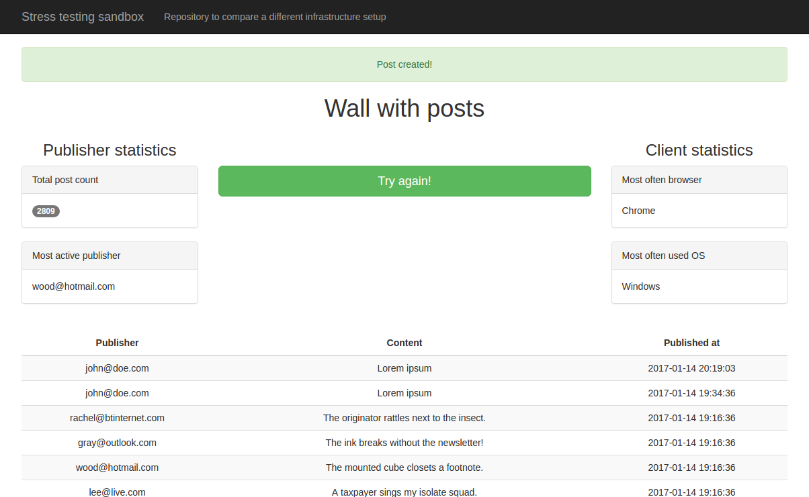
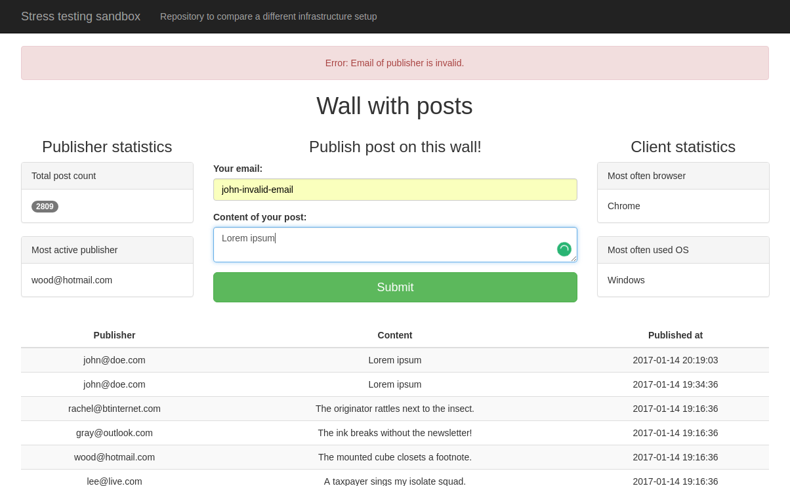

# PHP application

`php-application` is a pretty simple application written in `PHP7` and with `redis-cache` as a storage. It simulates wall with posts.
It has framework agnostic model. It uses `CQRS` with `SimpleBus` for handling commands.
With `php-application` you can:
- render the wall with posts
- publish a post

During each request (effect of triggered domain event `PostWasPublished`) application updates the projection with statistics.
The statistics includes:
- Total number of posts on the wall
- Most active publisher
- Most often used browser
- Most often used os

## Scenario:

```gherkin
Feature: Publish post

  Scenario: Publish post
    Given I am a publisher with email "john@doe.com"
     When I publish post with id "d01b71a7-f78f-47ff-95fd-5b25c96b8028" and content "Hello world!"
     Then I should be notified that post was published
      And I post with id "d01b71a7-f78f-47ff-95fd-5b25c96b8028" should be published
```

## Components used for `php-application` worth to mention:
- `ramsey/uuid` - For generate `uuid`
- `predis/predis` - For integration with `redis-cache`
- `php-di/php-di` - For `dependency injection` and `container`
- `zendframework/zend-diactoros` - Web server, PSR-7 abstraction for request and response
- `piwik/device-detector` - For OS, Browser detection
- `phpspec/phpspec` - for unit-testing
- `phpunit/phpunit` - for integration-testing
- `behat/behat` - for behavior-testing

## See:
- [Specification](php-application/tests/unit)
- [Implementation](php-application/src)

## Screen shots from working application




