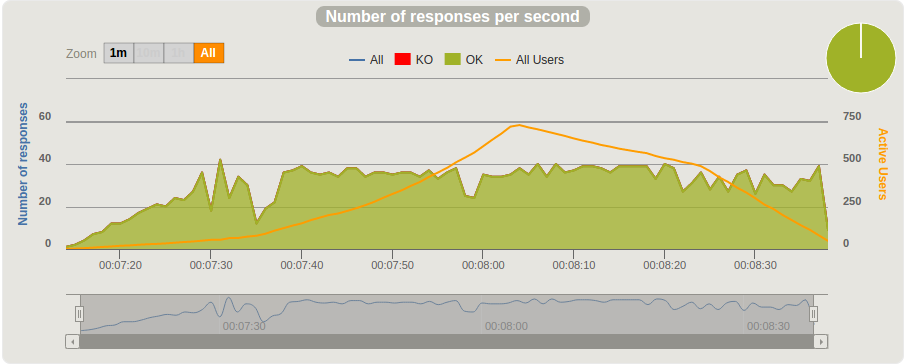

# Results

I made a few tries to compare multiple infrastructure setup:

## 1 x 1-CPU, 2GB RAM, Ubuntu 16.04 [Digitalocean](https://www.digitalocean.com/) droplet

| From [RPS] | to [RPS] |
|:-----------|:---------|
| 1          | 50       |

It can handle ~ **14** requests per second.
**See [result](https://htmlpreview.github.io/?https://github.com/lzakrzewski/stress-testing-sandbox/blob/master/doc/results/html/1x-1-CPU-2GB-16.04-50-50/index.html).**

## 2 x 1-CPU, 2GB RAM, Ubuntu 16.04 [Digitalocean](https://www.digitalocean.com/) droplet

| From [RPS] | to [RPS] |
|:-----------|:---------|
| 1          | 50       |

It can handle ~ **14** requests per second.
**See [result](https://htmlpreview.github.io/?https://github.com/lzakrzewski/stress-testing-sandbox/blob/master/doc/results/html/2x-1-CPU-2GB-16.04-50-50/index.html).**